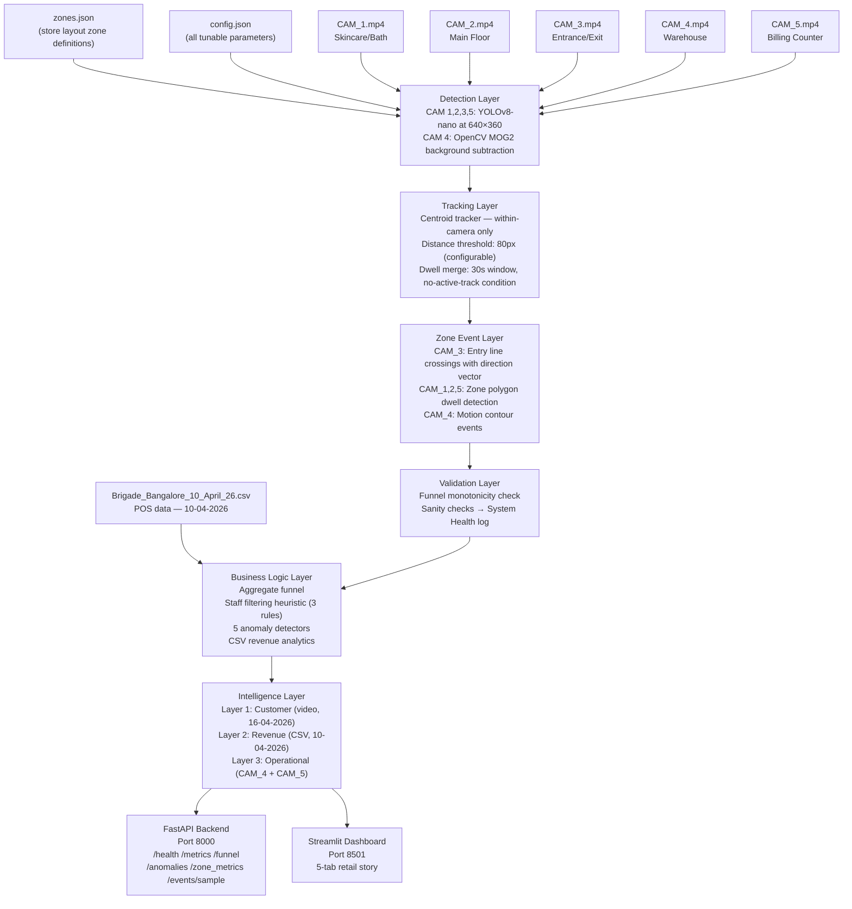
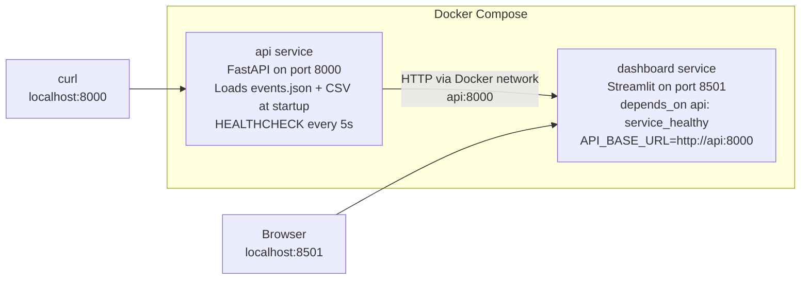
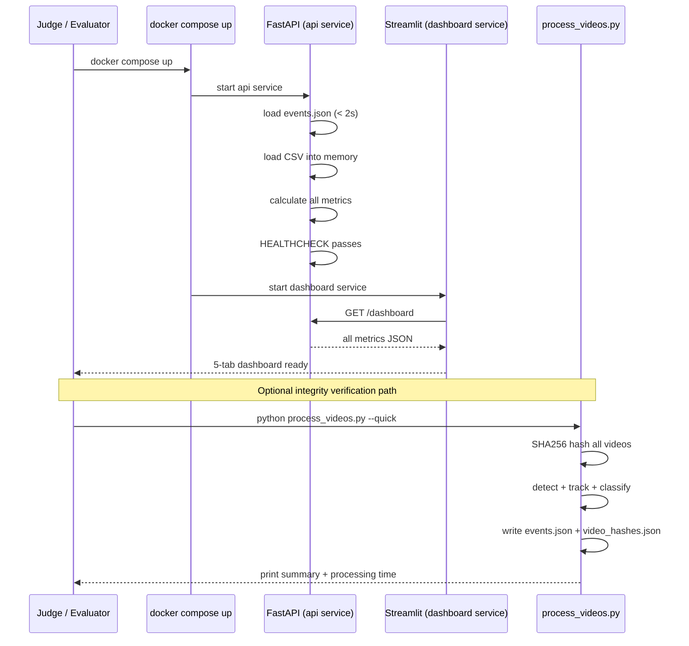

# DESIGN.md — Purplle Store Intelligence Platform
## System Architecture Document

Version: Phase 1 draft (to be finalised in Phase 7 with actual measured values)
Last Updated: 2026-05-31

---

## 1. Executive Summary

The Purplle Store Intelligence Platform answers three operational questions for the Brigade Road store:

1. **How many customers came, where did they go, and how long did they stay?**
   Answered by computer vision on 5 video feeds with store layout-aware zone analytics.

2. **What did the store sell, which categories performed, and what was the revenue?**
   Answered by POS transaction data analytics.

3. **What operational issues occurred and where?**
   Answered by queue monitoring at the billing counter and activity detection in the warehouse.

The system is designed as a product a store manager would pay for, not as a research experiment. Every design decision passes through the question: will a judge see this in under 10 minutes and think this person built a product?

---

## 2. Store Layout — Ground Truth

**Source:** Brigade_Road_Store_layout.xlsx (inspected in Phase 0).
**Finding:** The Excel file contains a floorplan image only. No machine-readable coordinates exist. All polygon coordinates in zones.json must be derived from video frame inspection using visualise_zones.py.

Store geometry (from floorplan image inspection):
- **Layout:** Long rectangular store
- **Entry door:** Left wall
- **Billing / Cash counter:** Right side
- **Skincare / Cosmetics shelving:** Top wall
- **Makeup shelving:** Bottom wall
- **F.O.H island + makeup units:** Center floor

This layout directly maps to the five camera zones.

---

## 3. System Architecture

### 3.1 Full Pipeline Diagram



### 3.2 Deployment Architecture



### 3.3 Startup vs Processing Separation



---

## 4. Configuration System

### 4.1 config.json — All Tunable Parameters

No magic numbers exist in code. Every threshold and limit is read from config.json at runtime.

| Parameter | Default | Rationale |
|-----------|---------|-----------|
| `max_frames_per_camera` | 1000 | Covers ~2–3 min of footage per camera at frame_skip 5. Configurable for depth vs speed trade-off. |
| `frame_skip` | 5 | Process every 5th frame. At 30fps, this processes 6fps — sufficient for walking-speed detection. |
| `detection_resolution` | [640, 360] | YOLOv8-nano performs reliably at this resolution on CPU. Larger resolution increases processing time quadratically. |
| `confidence_threshold` | 0.5 | Standard YOLOv8 default. Filters weak detections while retaining most true positives. |
| `tracker_distance_threshold` | 80 | At 640×360 with frame_skip 5, a walking person moves 15–30px between processed frames. 80px catches normal and fast movement without merging nearby people. |
| `warehouse_motion_threshold` | 500 | Minimum contour area (sq px) to count as motion event. Filters lighting flicker. **Must be calibrated in Phase 2 — CAM 4 flicker observed during inspection.** |
| `dwell_merge_window_seconds` | 30 | Session merge window for track ID reassignment after occlusion. |
| `zone_abandonment_window_seconds` | 300 | 5 minutes. If no zone visit follows an entry within this window, zone abandonment anomaly fires. |
| `repeat_visit_threshold` | 3 | Number of visits to the same zone before Anomaly 5 (repeat zone visits) fires. |
| `min_dwell_for_visit_seconds` | 10 | Minimum dwell to count as a zone visit. Excludes 2-second pass-throughs. |
| `queue_occupancy_threshold` | 2 | Number of simultaneous persons in billing zone to trigger queue monitoring. |
| `queue_duration_threshold_seconds` | 300 | 5 minutes of continuous queue above threshold triggers Anomaly 2. |
| `staff_filter_enabled` | true | Apply staff heuristic filtering by default. |
| `staff_roundtrip_threshold` | 3 | Crossing entry line in both directions more than this many times within the window → classified as staff. |
| `staff_roundtrip_window_minutes` | 30 | Time window (minutes) for counting staff roundtrips across the entry line. |

### 4.2 zones.json — Store Layout Zone Definitions

zones.json is a first-class system component. It is the bridge between the physical store layout and the detection pipeline. Every zone polygon must be derived from actual video frame inspection — coordinates are **never** invented.

| Camera | Zone | Intelligence Layer | Detection Method | Key Config |
|--------|------|--------------------|-----------------|------------|
| CAM_1 | skincare | customer | yolov8_nano | polygon (TODO — Phase 2) |
| CAM_2 | main_floor | customer | yolov8_nano | polygon (TODO — Phase 2) |
| CAM_3 | entrance | customer | yolov8n | entry_line [[80,170],[560,170]], entry_direction_vector [0,1] — FINALIZED |
| CAM_4 | warehouse | operational | background_subtraction | polygon (TODO — Phase 2) |
| CAM_5 | billing | customer_and_operational | yolov8_nano | polygon (TODO — Phase 2) |

Tool for coordinate extraction and visual verification: `visualise_zones.py`

---

## 5. Detection Layer

### 5.1 YOLOv8-nano — CAM 1, 2, 3, 5

**Model:** yolov8n.pt (~6MB, bundled in models/ directory, no network download required)
**Class:** 0 (person) only. All other detected classes are discarded.
**Resolution:** 640×360 (from config.json `detection_resolution`)
**Confidence filter:** 0.5 (from config.json `confidence_threshold`)
**Frame sampling:** Every 5th frame (from config.json `frame_skip`)

**Rationale for YOLOv8-nano:** Smallest YOLOv8 variant. Runs on CPU at acceptable speed for the sample-based processing approach (not real-time). Sufficient accuracy for retail density scenes. ~6MB model weight file keeps Docker image compact.

**Phase 2 validation requirement:** Confirm person detection works reliably in these specific videos at 640×360 on the target hardware. Record detection confidence distribution for all 5 cameras.

### 5.2 Background Subtraction — CAM 4 (Warehouse)

**Method:** OpenCV MOG2 (`cv2.createBackgroundSubtractorMOG2`)
**Why not YOLO for CAM 4:** The warehouse zone requires activity detection, not customer identification. MOG2 is faster, lighter, has no model dependency, and is more appropriate for detecting "is something moving?" rather than "is this a person?"

**Minimum contour area filter:**
- Default: 500 sq px (`warehouse_motion_threshold` in config.json)
- Purpose: Filters lighting flicker noise (produces small scattered pixels) while catching real human movement (produces large contiguous blobs)
- **CALIBRATION REQUIRED in Phase 2:** CAM 4 lighting flicker was observed during Phase 0 video inspection. The threshold may need to be raised to 500–2000 sq px. Calibration method: measure maximum contour area from flicker-only frames (no human present), set threshold above this maximum.

**MOG2 advantages:** Adapts to slow lighting changes (gradual brightness shifts). Sensitive to sudden motion but filters sustained background.

---

## 6. Tracking Layer

### 6.1 Centroid Tracker (Primary)

A lightweight centroid tracker with zero external dependencies.

**Algorithm:**
1. Extract bounding box centroid from each YOLO detection.
2. For each new frame's centroids, compute Euclidean distance to all existing active tracks.
3. Match new detection to nearest active track if distance < `tracker_distance_threshold` (80px).
4. If no match within threshold, assign new track ID.
5. If an active track has no matched detection for N consecutive frames, mark it as disappeared.

**Why centroid tracker over ByteTrack:**
- Zero external dependency chain (ByteTrack requires scipy, lap or lapjv, sometimes Cython)
- ByteTrack has documented installation failures in CPU-only Docker environments
- For zone-level aggregate analytics, centroid tracking is sufficient — we do not need precise re-identification across long occlusions
- ByteTrack is documented as a conditional fallback if Phase 2 validation reveals centroid tracker failures (see decisions_log.txt Decision 5)

**Phase 2 validation requirement:** A single walking person must maintain one consistent track ID for at least 20 consecutive processed frames. If track IDs reset more than 3 times in one minute, investigate and potentially switch to ByteTrack.

### 6.2 Dwell Time Merge Rule

When a track disappears due to occlusion and reappears, the tracker assigns a new ID, splitting one person's visit into two artificially short sessions.

**Merge condition (both must be true):**
1. A new track appears in the same zone within `dwell_merge_window_seconds` (30s) of a previous track ending.
2. The zone currently has **no other active tracks** at that moment.

The second condition is critical. Without it, two different people visiting the same zone in quick succession would be falsely merged into one session, inflating dwell times.

---

## 7. Zone Event Layer

### 7.1 Entry Line Crossing — CAM 3

**Purpose:** Count customer entries and exits at the store entrance. This is the top of the customer funnel.

**Method:** Centroid crossing detection.
- Track a detection's bounding box centroid across consecutive processed frames.
- If the centroid moves from one side of `entry_line` to the other between two frames, a crossing event is generated.
- The `entry_direction_vector` in zones.json determines which direction = entry, which = exit.

**Why centroid crossing:** On CPU with frame_skip 5, centroid crossing is reliable for normal walking speed. Fast crossings within skipped frames are missed by either centroid or bounding-box methods equally.

**entry_direction_vector definition:**
- Points from street side toward store interior = entry direction
- Reverse = exit direction
- Determined in Phase 2 by inspecting actual CAM_3 camera angle

**Phase 2 validation requirement:** Test entry line coordinates against at least 10 actual crossings from the CAM_3 video. Count how many are correctly detected and classified. Record accuracy in decisions_log.txt.

### 7.2 Zone Dwell Detection — CAM 1, 2, 5

For each tracked person in each camera:
1. Record the first frame where centroid is inside the zone polygon.
2. Record the last frame where centroid is inside the zone polygon.
3. Compute dwell_seconds from frame timestamps.
4. Apply dwell merge rule (Section 6.2).
5. Discard visits with dwell_seconds < `min_dwell_for_visit_seconds` (10s).

### 7.3 Motion Events — CAM 4

Each frame where MOG2 detects contours exceeding `warehouse_motion_threshold` generates one motion event:
```json
{
  "event_type": "warehouse_motion",
  "frame_idx": 450,
  "timestamp_seconds": 75.0,
  "contour_area": 1240,
  "camera": "CAM_4"
}
```
Consecutive motion events within a configurable window are aggregated into a restocking event.

---

## 8. Event Schema (Frozen)

All events written to events.json share a common envelope. Specific event types add their own fields.

### 8.1 Common Envelope

```json
{
  "event_id": "unique_string",
  "event_type": "zone_entry | zone_exit | zone_dwell | crossing_entry | crossing_exit | warehouse_motion | queue_alert",
  "camera": "CAM_1 | CAM_2 | CAM_3 | CAM_4 | CAM_5",
  "frame_idx": 450,
  "timestamp_seconds": 75.0,
  "processed_at": "2026-04-16T10:30:00Z"
}
```

### 8.2 Person Detection Event (CAM 1, 2, 3, 5)

```json
{
  "event_type": "zone_dwell",
  "camera": "CAM_1",
  "zone": "skincare",
  "track_id": 7,
  "bbox": [x1, y1, x2, y2],
  "centroid": [cx, cy],
  "confidence": 0.72,
  "dwell_seconds": 145,
  "frame_entry": 100,
  "frame_exit": 145,
  "timestamp_entry_seconds": 16.7,
  "timestamp_exit_seconds": 24.2,
  "staff_filtered": false
}
```

### 8.3 Entry Crossing Event (CAM 3)

```json
{
  "event_type": "crossing_entry",
  "camera": "CAM_3",
  "zone": "entrance",
  "track_id": 12,
  "centroid_before": [cx1, cy1],
  "centroid_after": [cx2, cy2],
  "frame_idx": 210,
  "timestamp_seconds": 35.0,
  "crossing_direction": "entry",
  "staff_filtered": false
}
```

### 8.4 Warehouse Motion Event (CAM 4)

```json
{
  "event_type": "warehouse_motion",
  "camera": "CAM_4",
  "zone": "warehouse",
  "frame_idx": 450,
  "timestamp_seconds": 75.0,
  "contour_area": 1240,
  "is_restocking_event": false
}
```

---

## 9. Three Intelligence Layers

All three layers are kept strictly separate in both computation and presentation. No causal claim is made between layers.

### Layer 1 — Customer Intelligence (video, 16-04-2026)

| Metric | Source | Method |
|--------|--------|--------|
| Total entries (staff-filtered) | CAM_3 crossing events | Entry line crossing count, staff heuristic applied |
| Total exits | CAM_3 crossing events | Exit direction crossing count |
| Per-zone visit counts | CAM_1, CAM_2, CAM_5 | Zone polygon dwell events, dwell > 10s |
| Average dwell per zone | CAM_1, CAM_2, CAM_5 | Mean dwell_seconds with merge rule applied |
| Peak traffic hour | CAM_3 | Bin entry crossings by hour |
| Zone popularity ranking | CAM_1, CAM_2, CAM_5 | Visit count descending |
| Staff movements count | CAM_3 | Crossings filtered by staff heuristic |

### Layer 2 — Revenue Intelligence (POS CSV, 10-04-2026)

**Date note:** CSV is from 10-04-2026. Video is from 16-04-2026. Different dates. These layers are **separate intelligence sources**, never fused at individual level.

| Metric | Column(s) | Priority |
|--------|-----------|----------|
| Total transactions | unique order_id | Core |
| Total GMV | GMV | Core |
| Total NMV | NMV | Core |
| Top categories by revenue | dep_name + GMV | Core |
| Category distribution | dep_name | Core |
| Average basket depth | qty per order_id | Core |
| Salesperson performance | salesperson_name + NMV | Enhancement |
| Private Brand vs External | brand_type + GMV | Enhancement |
| Promotion effectiveness | offer_name + GMV | Enhancement |
| Time-of-day revenue curve | order_time (hour bins) | Enhancement |

### Layer 3 — Operational Intelligence (video, 16-04-2026)

| Metric | Source | Method |
|--------|--------|--------|
| Warehouse activity timeline | CAM_4 | MOG2 motion events by timestamp |
| Restocking events | CAM_4 | Consecutive motion frames aggregated |
| Queue length | CAM_5 | Simultaneous person count in billing polygon |
| Queue duration alerts | CAM_5 | Continuous occupancy > threshold > 300s |
| Crowding events by zone | CAM_1, CAM_2 | Simultaneous track count > configurable threshold |

---

## 10. Business Logic Layer

### 10.1 Aggregate Customer Funnel

Five-stage aggregate funnel using zone-level counts, not individual tracking:

```
Stage 1: CAM_3 entry crossings (staff-filtered)           → total_entries
Stage 2: CAM_2 zone visits (dwell > 10s)                  → main_floor_visits
Stage 3: CAM_1 zone visits (dwell > 10s)                  → skincare_visits
Stage 4: CAM_5 billing interactions (dwell > 10s)         → billing_interactions
Stage 5: POS CSV transactions (10-04-2026, separate data) → transaction_count
```

**No claim is made that the same person appears at multiple stages.** The funnel is aggregate observational data, not individual journey tracking.

### 10.2 Funnel Monotonicity Validation

After computing funnel, a post-processing check runs:

- **Check A:** `billing_interactions` should not significantly exceed `total_entries`. If billing > entries × 1.2, log WARNING.
- **Check B:** `main_floor_visits` should be ≥ `skincare_visits` (main floor is between entrance and skincare). If not, log WARNING.

Results are visible in System Health tab. A WARNING does not block the API — it is a transparency signal for judges.

### 10.3 Staff Filtering Heuristic

Applied by default when `staff_filter_enabled = true`. Three CAM_3-local rules (no cross-camera identity required):

**Rule 1 — Roundtrip pattern:**
A track that crosses the entry line in **both directions** more than `staff_roundtrip_threshold` (3) times within `staff_roundtrip_window_minutes` (30 minutes) is classified as staff. Reflects the characteristic behaviour of staff making multiple trips in and out.

**Rule 2 — Billing station occupancy:**
A person already present at the billing counter area (CAM_5 polygon) without a preceding entry detection in CAM_3 during the recording window is classified as staff stationed at checkout.

**Rule 3 — Pre-recording presence:**
A person detected inside the store in the **first frame** of the recording is classified as staff on duty before store opening or before the recording began.

All three rules operate within individual camera views. Classified tracks are excluded from customer metrics and counted separately as `staff_filtered_count`, which is displayed in the System Health tab.

### 10.4 Five Anomaly Detectors

All five anomalies use video data only. No anomaly crosses datasets.

| # | Type | Trigger | Recommendation | Source |
|---|------|---------|---------------|--------|
| 1 | Extended Zone Occupancy | Dwell > 15 min in CAM_1 or CAM_5 | Customer may need assistance | Session data |
| 2 | Queue Buildup at Billing | CAM_5 occupancy > 2 persons for > 300s | Open additional checkout lane | CAM_5 zone events |
| 3 | Unusual Warehouse Activity | CAM_4 motion outside expected time window | Investigate unscheduled access | MOG2 events |
| 4 | Zone Abandonment | Entry at CAM_3, no zone visit within 300s | Review entrance experience/signage | CAM_3 + CAM_1/2 |
| 5 | Repeat Zone Visits | Same zone visited > 3 times with dwell > 10s each | Review product display/pricing | Session data |

**Anomaly 4 boundary guard:** Computed only for entries in the **first 70%** of the processing window. Entries near the end may have their follow-up zone visit after the window closes — including them would cause false positives.

Each anomaly returns:
```json
{
  "type": "queue_buildup",
  "severity": "warning",
  "message": "Billing zone occupancy exceeded 2 persons for 8 continuous minutes",
  "business_recommendation": "Consider opening additional checkout lane",
  "triggered_at": "2026-04-16T16:42:00Z"
}
```

---

## 11. API Design

All endpoints load data from memory at startup. Target: all responses < 500ms.

| Endpoint | Method | Response | Notes |
|----------|--------|----------|-------|
| `/health` | GET | System status, video hashes, config, last 50 log entries | First thing judges check |
| `/metrics` | GET | traffic + sales + operations sections | Three clearly labelled sections |
| `/funnel` | GET | Funnel counts + validation result + disclaimer | Aggregate disclaimer always present |
| `/anomalies` | GET | List of anomaly dicts with business_recommendation | All 5 types, triggered_at timestamps |
| `/zone_metrics/{zone}` | GET | Per-zone stats | 404 with valid_zones list for unknown zone names |
| `/events/sample` | GET | 10 raw events from events.json | Integrity verification for judges |
| `/dashboard` | GET | All data in one call | Streamlit consumption endpoint |

**Logging:** Every API call logs `{timestamp, endpoint, response_time_ms, events_count}` via Python's `logging` module with JSON formatter. Last 50 entries accessible via `/health`.

---

## 12. Docker Architecture

### 12.1 Two-Service Configuration

**api service:**
- FastAPI on port 8000
- Copies `models/yolov8n.pt` into image (no network download at startup)
- Copies `events/events.json` and `data/` into image
- HEALTHCHECK: `curl -f http://localhost:8000/health || exit 1` every 5s, 6 retries

**dashboard service:**
- Streamlit on port 8501
- `depends_on: api: condition: service_healthy` — waits for backend health check before starting
- Environment variable: `API_BASE_URL=http://api:8000` (uses Docker service name for internal network)
- Streamlit code: `API_URL = os.getenv("API_BASE_URL", "http://localhost:8000")` — works both inside Docker and in local development

**Critical:** Without `depends_on` with `condition: service_healthy`, Docker silently ignores the dependency and both services start simultaneously, causing the dashboard to fail on its first API call.

### 12.2 YOLO Weights Bundled

`yolov8n.pt` is copied into the Docker image during build. No network access is required during startup or video processing. This prevents startup hangs in evaluation environments without internet access.

---

## 13. Dashboard Structure

### Tab 1 — Executive Overview
KPI cards: total entries (staff-filtered), average dwell time, zone visits count, total GMV, transaction count.
Chart: entries per hour (timeline from CAM_3 data).

### Tab 2 — Customer Journey (Aggregate)
Funnel chart: 5 stages with conversion percentages between each stage.
Label: **"Aggregate zone counts — no individual tracking."**
Traffic-Sales Alignment panel (visually separated): date mismatch disclaimer always visible.

### Tab 3 — Zone Intelligence
Per-zone metrics: visit count, average dwell, peak time.
Zone popularity heatmap.
Store layout image with zone polygon markers if coordinates are available from zones.json.

### Tab 4 — Revenue Intelligence
GMV, NMV, transactions. Top categories. Private Brand vs External. Salesperson ranking. Promotion chart. Time-of-day revenue curve.

### Tab 5 — Operational Intelligence + System Health
Warehouse activity timeline. Queue alerts. Crowding events.
Funnel validation result (pass / warning). Staff movements count. Events loaded count.
Video hash fingerprint. Last processing timestamp and duration. API endpoint status. Recent log entries (last 50).

---

## 14. Integrity Defence

When `process_videos.py` runs, it:
1. Computes SHA256 hash of every video file in `inputs/`
2. Writes `events/video_hashes.json`
3. Writes `events/events.json` with all computed events

The `/health` endpoint returns these hashes. The System Health tab displays them. A judge who wants to verify that events were computed from real video — not fabricated — can:
1. Note the hashes displayed in System Health
2. Run `python process_videos.py` with the original video files
3. Verify the hashes in `events/video_hashes.json` match

If a video file is replaced and `process_videos.py` is rerun, hashes change, events regenerate, and API metrics update — proving the pipeline is live, not hardcoded.

---

## 15. Honest Limitations

| Limitation | What it means | What we say |
|-----------|---------------|------------|
| No cross-camera person tracking | Cannot link person in CAM_1 to person in CAM_5 | Stated in every funnel disclaimer |
| Date mismatch | Video 16-04, CSV 10-04 — different days | Stated in every metric label and disclaimer |
| Frame sampling | 1000 frames at skip 5 ≈ 2–3 minutes per camera | Stated in README and System Health |
| Staff filter is heuristic | Three pattern-based rules, not badge/face recognition | Staff count shown transparently in System Health |
| Dwell merge is approximate | Merge rule corrects most ID splits, not all | Methodology documented in CHOICES.md |
| Zone polygons are manually derived | No automated coordinate extraction from layout | visualise_zones.py enables iterative verification |
| CPU-only processing | 15–60+ min total processing time | Stated in README with actual measured time |

---

## 16. Future Architecture Roadmap

*(Demonstrates system thinking beyond current scope — zero implementation cost)*

- **Cross-camera re-identification:** Deep learning ReID models (OSNet, Fast-ReID) would enable true person-level journey tracking. Not implemented due to CPU constraints and time scope.
- **Real-time streaming:** Replace batch processing with a Kafka event bus for live zone occupancy dashboards with sub-second latency.
- **Multi-store deployment:** zones.json is deliberately designed to be portable across store layouts. Different stores require only a new zone configuration file — no code changes.
- **LLM-generated insights:** Structured events and business metrics could feed a language model to generate natural-language store manager reports.
- **Staffing intelligence:** With proper badge/face recognition, staff movement patterns could become an operational scheduling input rather than a filtered noise source.
